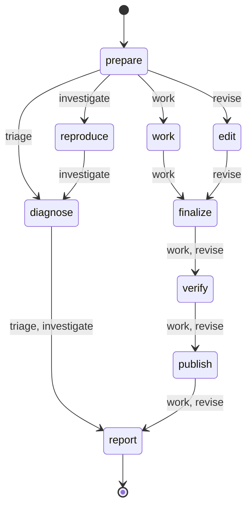

# emdashbot lifecycle machines

<!-- Generated from .flue/lib/machine.ts by `pnpm bot:generate`. Do not edit by hand. -->

The issue lifecycle coordinates the long-lived GitHub item. The agent run lifecycle records one bounded execution attempt. GitHub labels project the issue state; run mode and phase remain in Durable Object storage.

## Issue lifecycle

Entry state: `unmanaged`. Kinds: `bug`, `enhancement`, `task`.

### Phases

| Phase | Label |
| --- | --- |
| `intake` | Triage |
| `evidence` | Investigate |
| `verdict` | Establish |
| `candidate` | Build |
| `preview` | Preview |
| `confirmation` | Confirm |
| `review` | Review |
| `complete` | Done |

### States

| State | Phase | Label | Board column | Terminal | Transient | Offered commands |
| --- | --- | --- | --- | --- | --- | --- |
| `unmanaged` | `intake` | — | (none) | no | no | `triage`, `work`, `investigate`, `decline` |
| `triage` | `intake` | `bot:triage` | Triage | no | no | `triage`, `work`, `investigate`, `decline` |
| `triaging` | `intake` | `bot:triaging` | Triage | no | yes | `status`, `work`, `take_over` |
| `awaiting_approval` | `verdict` | `bot:awaiting-approval` | Awaiting approval | no | no | `work`, `triage`, `investigate`, `decline`, `take_over` |
| `working` | `evidence` | `bot:working` | Working | no | yes | `status` |
| `blocked` | `candidate` | `bot:blocked` | Blocked | no | no | `triage`, `work`, `investigate`, `retry`, `decline`, `take_over` |
| `in_review` | `review` | `bot:in-review` | In review | no | no | `work`, `decline`, `take_over` |
| `human_owned` | `review` | `bot:human-owned` | Human owned | no | no | `hand_back` |
| `done` | `complete` | `bot:done` | Done | yes | no | `reopen` |
| `declined` | `complete` | `bot:declined` | Declined | yes | no | `reopen` |
| `needs_attention` | `candidate` | `bot:needs-attention` | Needs attention | no | no | `retry`, `work`, `triage`, `investigate`, `decline`, `take_over` |
| `investigating` | `evidence` | `bot:investigating` | Investigating | no | yes | `status` |
| `reproduced` | `verdict` | `bot:reproduced` | Reproduced | no | no | `work`, `investigate`, `decline`, `take_over` |
| `diagnosed` | `verdict` | `bot:diagnosed` | Diagnosed | no | no | `work`, `investigate`, `decline`, `take_over` |
| `not_reproduced` | `verdict` | `bot:not-reproduced` | Not reproduced | no | no | `triage`, `investigate`, `decline`, `take_over` |
| `needs_info` | `verdict` | `bot:needs-info` | Needs info | no | no | `triage`, `work`, `investigate`, `decline`, `take_over` |
| `preview_building` | `preview` | `bot:preview-building` | Building preview | no | yes | `status` |
| `awaiting_reporter` | `confirmation` | `bot:awaiting-reporter` | Awaiting reporter | no | no | `accept`, `needs_changes`, `decline`, `take_over` |

### Events

| Event | Category | Actors | Arg | Description |
| --- | --- | --- | --- | --- |
| `triage` | command | maintainer, system | `directive` | Classify the issue, apply useful labels, ask for missing information, and proceed automatically only when the work is clear and low risk. |
| `work` | command | maintainer | `directive` | Take the issue as far as a verified candidate release, reproducing bugs when appropriate. |
| `accept` | command | reporter, maintainer | — | Confirm the candidate works and open its draft pull request. |
| `needs_changes` | command | reporter, maintainer | `feedback` | Explain what is still wrong so the bot can revise the candidate. |
| `investigate` | command | maintainer | `directive` | Reproduce and diagnose the issue as a bug, with evidence. Does not attempt a fix. |
| `retry` | command | maintainer | — | Retry the last triage, investigation, work, or PR repair run. |
| `decline` | command | maintainer | — | Won't be actioned; move to declined. |
| `reopen` | command | maintainer | — | Bring a terminal item back into triage. |
| `take_over` | command | maintainer | — | A maintainer takes the item; the bot disengages but stays on the board. |
| `hand_back` | command | maintainer | — | Return a human-owned item to the bot. |
| `reset` | command | maintainer | — | Force-reset to triage. Maintainer recovery for conflicting state labels. |
| `status` | command | reporter, maintainer | — | Render the item's current state and available commands. |
| `help` | command | reporter, maintainer | — | Show the command grammar. |
| `agent.auto_work` | agent result | system | — | Triage found an obvious, low-risk task that can proceed automatically. |
| `agent.awaiting_approval` | agent result | system | — | Triage found work that needs maintainer approval. |
| `agent.skipped` | agent result | system | — | Agent skipped (non-bug kind, or repro needs external/prod-only conditions). |
| `agent.not_reproduced` | agent result | system | — | Agent could not reproduce the issue. |
| `agent.by_design` | agent result | system | — | Agent verified the behaviour as intended. |
| `agent.reproduced` | agent result | system | — | Reproduced, but the fix needs a human decision. |
| `agent.diagnosed` | agent result | system | — | Root cause identified without a confirming reproduction. |
| `agent.revised` | agent result | system | — | Review feedback is addressed and the PR branch is updated. |
| `agent.fix_ready` | agent result | system | — | A candidate change is published on bot/fix-<n>. |
| `agent.needs_info` | agent result | system | — | Investigation is blocked on information only the reporter can supply. |
| `agent.failed` | agent result | system | — | Agent run errored or produced no usable result. |
| `pr.opened` | pr lifecycle | system | — | A bot PR was opened for this item. |
| `pr.updated` | pr lifecycle | system | — | The attached PR head changed; refresh its checks and review state. |
| `pr.problems` | pr lifecycle | system | `feedback` | The attached PR has failing checks, conflicts, or requested changes. |
| `pr.green` | pr lifecycle | system | — | The attached PR is mergeable and all reported checks pass. |
| `pr.merged` | pr lifecycle | system | — | The bot PR was merged. |
| `pr.closed` | pr lifecycle | system | — | The bot PR was closed without merging. |
| `pr.approved` | pr lifecycle | system | — | A reviewer approved the PR (review sub-state). |
| `preview.ready` | preview | system | — | The preview deploy for the candidate change is live; link ready to post. |
| `preview.failed` | preview | system | — | The preview deploy failed to build. |
| `expire` | timer | system | — | The reporter-confirmation window elapsed without a reply. |

### Transitions

| From | Event | To | Action |
| --- | --- | --- | --- |
| `unmanaged` | `triage` | `triaging` | `investigate.triage` |
| `unmanaged` | `work` | `working` | `investigate.work` |
| `triage` | `triage` | `triaging` | `investigate.triage` |
| `triage` | `work` | `working` | `investigate.work` |
| `triaging` | `agent.auto_work` | `working` | `investigate.work` |
| `triaging` | `agent.awaiting_approval` | `awaiting_approval` | — |
| `triaging` | `agent.needs_info` | `needs_info` | — |
| `triaging` | `agent.not_reproduced` | `awaiting_approval` | — |
| `triaging` | `agent.diagnosed` | `awaiting_approval` | — |
| `triaging` | `agent.reproduced` | `awaiting_approval` | — |
| `triaging` | `agent.by_design` | `awaiting_approval` | — |
| `triaging` | `agent.skipped` | `awaiting_approval` | — |
| `triaging` | `agent.failed` | `needs_attention` | — |
| `triaging` | `work` | `working` | `investigate.work` |
| `triaging` | `take_over` | `human_owned` | — |
| `triaging` | `decline` | `declined` | — |
| `awaiting_approval` | `triage` | `triaging` | `investigate.triage` |
| `awaiting_approval` | `work` | `working` | `investigate.work` |
| `awaiting_approval` | `investigate` | `investigating` | `investigate.diagnose` |
| `awaiting_approval` | `take_over` | `human_owned` | — |
| `awaiting_approval` | `decline` | `declined` | — |
| `needs_attention` | `retry` | `working` | `investigate.work` |
| `needs_attention` | `work` | `working` | `investigate.work` |
| `needs_attention` | `triage` | `triaging` | `investigate.triage` |
| `needs_attention` | `investigate` | `investigating` | `investigate.diagnose` |
| `needs_attention` | `take_over` | `human_owned` | — |
| `needs_attention` | `decline` | `declined` | — |
| `needs_attention` | `pr.updated` | `needs_attention` | — |
| `needs_attention` | `pr.problems` | `in_review` | `investigate.revise` |
| `needs_attention` | `pr.green` | `in_review` | — |
| `needs_attention` | `pr.merged` | `done` | — |
| `needs_attention` | `pr.closed` | `needs_attention` | — |
| `needs_info` | `triage` | `triaging` | `investigate.triage` |
| `done` | `triage` | `triaging` | `investigate.triage` |
| `declined` | `triage` | `triaging` | `investigate.triage` |
| `unmanaged` | `decline` | `declined` | — |
| `triage` | `decline` | `declined` | — |
| `working` | `agent.skipped` | `blocked` | — |
| `working` | `agent.not_reproduced` | `not_reproduced` | — |
| `working` | `agent.by_design` | `blocked` | — |
| `working` | `agent.reproduced` | `reproduced` | — |
| `working` | `agent.diagnosed` | `diagnosed` | — |
| `working` | `agent.needs_info` | `needs_info` | — |
| `working` | `agent.fix_ready` | `preview_building` | — |
| `working` | `agent.revised` | `in_review` | — |
| `working` | `agent.failed` | `needs_attention` | — |
| `blocked` | `triage` | `triaging` | `investigate.triage` |
| `blocked` | `work` | `working` | `investigate.work` |
| `blocked` | `retry` | `working` | `investigate.repro` |
| `blocked` | `decline` | `declined` | — |
| `blocked` | `take_over` | `human_owned` | — |
| `in_review` | `pr.opened` | `in_review` | — |
| `in_review` | `pr.approved` | `in_review` | — |
| `in_review` | `work` | `in_review` | `investigate.revise` |
| `in_review` | `needs_changes` | `in_review` | `investigate.revise` |
| `in_review` | `pr.updated` | `in_review` | — |
| `in_review` | `pr.problems` | `in_review` | `investigate.revise` |
| `in_review` | `pr.green` | `in_review` | — |
| `in_review` | `agent.revised` | `in_review` | — |
| `in_review` | `agent.failed` | `needs_attention` | — |
| `in_review` | `pr.merged` | `done` | — |
| `working` | `pr.merged` | `done` | — |
| `in_review` | `pr.closed` | `needs_attention` | — |
| `working` | `pr.closed` | `blocked` | — |
| `unmanaged` | `reset` | `triage` | — |
| `triage` | `reset` | `triage` | — |
| `working` | `reset` | `triage` | — |
| `blocked` | `reset` | `triage` | — |
| `in_review` | `reset` | `triage` | — |
| `human_owned` | `reset` | `triage` | — |
| `done` | `reset` | `triage` | — |
| `declined` | `reset` | `triage` | — |
| `in_review` | `decline` | `declined` | `closePr` |
| `in_review` | `take_over` | `human_owned` | — |
| `human_owned` | `hand_back` | `triage` | — |
| `done` | `reopen` | `triage` | — |
| `declined` | `reopen` | `triage` | — |
| `unmanaged` | `investigate` | `investigating` | `investigate.diagnose` |
| `triage` | `investigate` | `investigating` | `investigate.diagnose` |
| `blocked` | `investigate` | `investigating` | `investigate.diagnose` |
| `not_reproduced` | `investigate` | `investigating` | `investigate.diagnose` |
| `needs_info` | `investigate` | `investigating` | `investigate.diagnose` |
| `reproduced` | `investigate` | `investigating` | `investigate.diagnose` |
| `investigating` | `agent.reproduced` | `reproduced` | — |
| `investigating` | `agent.diagnosed` | `diagnosed` | — |
| `investigating` | `agent.not_reproduced` | `not_reproduced` | — |
| `investigating` | `agent.needs_info` | `needs_info` | — |
| `investigating` | `agent.by_design` | `blocked` | — |
| `investigating` | `agent.skipped` | `blocked` | — |
| `investigating` | `agent.failed` | `needs_attention` | — |
| `reproduced` | `work` | `working` | `investigate.work` |
| `reproduced` | `needs_changes` | `working` | `investigate.work` |
| `reproduced` | `decline` | `declined` | — |
| `reproduced` | `take_over` | `human_owned` | — |
| `diagnosed` | `work` | `working` | `investigate.work` |
| `diagnosed` | `needs_changes` | `working` | `investigate.work` |
| `diagnosed` | `decline` | `declined` | — |
| `diagnosed` | `take_over` | `human_owned` | — |
| `diagnosed` | `investigate` | `investigating` | `investigate.diagnose` |
| `not_reproduced` | `triage` | `triaging` | `investigate.triage` |
| `not_reproduced` | `decline` | `declined` | — |
| `not_reproduced` | `take_over` | `human_owned` | — |
| `needs_info` | `work` | `working` | `investigate.work` |
| `needs_info` | `decline` | `declined` | — |
| `needs_info` | `take_over` | `human_owned` | — |
| `preview_building` | `preview.ready` | `awaiting_reporter` | — |
| `preview_building` | `preview.failed` | default: `reproduced`; `enhancement`: `blocked`; `task`: `blocked` | — |
| `awaiting_reporter` | `accept` | `in_review` | `openDraftPr` |
| `awaiting_reporter` | `needs_changes` | `working` | `investigate.revise` |
| `awaiting_reporter` | `work` | `working` | `investigate.revise` |
| `awaiting_reporter` | `expire` | default: `reproduced`; `enhancement`: `blocked`; `task`: `blocked` | `reapBranch` |
| `awaiting_reporter` | `take_over` | `human_owned` | — |
| `awaiting_reporter` | `decline` | `declined` | `reapBranch` |
| `investigating` | `reset` | `triage` | — |
| `reproduced` | `reset` | `triage` | — |
| `not_reproduced` | `reset` | `triage` | — |
| `needs_info` | `reset` | `triage` | — |
| `preview_building` | `reset` | `triage` | — |
| `awaiting_reporter` | `reset` | `triage` | — |
| `triaging` | `reset` | `triage` | — |
| `awaiting_approval` | `reset` | `triage` | — |
| `needs_attention` | `reset` | `triage` | — |

### Diagram

```mermaid
stateDiagram-v2
    [*] --> unmanaged
    unmanaged --> triaging: triage / investigate.triage
    unmanaged --> working: work / investigate.work
    triage --> triaging: triage / investigate.triage
    triage --> working: work / investigate.work
    triaging --> working: agent.auto_work / investigate.work
    triaging --> awaiting_approval: agent.awaiting_approval
    triaging --> needs_info: agent.needs_info
    triaging --> awaiting_approval: agent.not_reproduced
    triaging --> awaiting_approval: agent.diagnosed
    triaging --> awaiting_approval: agent.reproduced
    triaging --> awaiting_approval: agent.by_design
    triaging --> awaiting_approval: agent.skipped
    triaging --> needs_attention: agent.failed
    triaging --> working: work / investigate.work
    triaging --> human_owned: take_over
    triaging --> declined: decline
    awaiting_approval --> triaging: triage / investigate.triage
    awaiting_approval --> working: work / investigate.work
    awaiting_approval --> investigating: investigate / investigate.diagnose
    awaiting_approval --> human_owned: take_over
    awaiting_approval --> declined: decline
    needs_attention --> working: retry / investigate.work
    needs_attention --> working: work / investigate.work
    needs_attention --> triaging: triage / investigate.triage
    needs_attention --> investigating: investigate / investigate.diagnose
    needs_attention --> human_owned: take_over
    needs_attention --> declined: decline
    needs_attention --> needs_attention: pr.updated
    needs_attention --> in_review: pr.problems / investigate.revise
    needs_attention --> in_review: pr.green
    needs_attention --> done: pr.merged
    needs_attention --> needs_attention: pr.closed
    needs_info --> triaging: triage / investigate.triage
    done --> triaging: triage / investigate.triage
    declined --> triaging: triage / investigate.triage
    unmanaged --> declined: decline
    triage --> declined: decline
    working --> blocked: agent.skipped
    working --> not_reproduced: agent.not_reproduced
    working --> blocked: agent.by_design
    working --> reproduced: agent.reproduced
    working --> diagnosed: agent.diagnosed
    working --> needs_info: agent.needs_info
    working --> preview_building: agent.fix_ready
    working --> in_review: agent.revised
    working --> needs_attention: agent.failed
    blocked --> triaging: triage / investigate.triage
    blocked --> working: work / investigate.work
    blocked --> working: retry / investigate.repro
    blocked --> declined: decline
    blocked --> human_owned: take_over
    in_review --> in_review: pr.opened
    in_review --> in_review: pr.approved
    in_review --> in_review: work / investigate.revise
    in_review --> in_review: needs_changes / investigate.revise
    in_review --> in_review: pr.updated
    in_review --> in_review: pr.problems / investigate.revise
    in_review --> in_review: pr.green
    in_review --> in_review: agent.revised
    in_review --> needs_attention: agent.failed
    in_review --> done: pr.merged
    working --> done: pr.merged
    in_review --> needs_attention: pr.closed
    working --> blocked: pr.closed
    unmanaged --> triage: reset
    triage --> triage: reset
    working --> triage: reset
    blocked --> triage: reset
    in_review --> triage: reset
    human_owned --> triage: reset
    done --> triage: reset
    declined --> triage: reset
    in_review --> declined: decline / closePr
    in_review --> human_owned: take_over
    human_owned --> triage: hand_back
    done --> triage: reopen
    declined --> triage: reopen
    unmanaged --> investigating: investigate / investigate.diagnose
    triage --> investigating: investigate / investigate.diagnose
    blocked --> investigating: investigate / investigate.diagnose
    not_reproduced --> investigating: investigate / investigate.diagnose
    needs_info --> investigating: investigate / investigate.diagnose
    reproduced --> investigating: investigate / investigate.diagnose
    investigating --> reproduced: agent.reproduced
    investigating --> diagnosed: agent.diagnosed
    investigating --> not_reproduced: agent.not_reproduced
    investigating --> needs_info: agent.needs_info
    investigating --> blocked: agent.by_design
    investigating --> blocked: agent.skipped
    investigating --> needs_attention: agent.failed
    reproduced --> working: work / investigate.work
    reproduced --> working: needs_changes / investigate.work
    reproduced --> declined: decline
    reproduced --> human_owned: take_over
    diagnosed --> working: work / investigate.work
    diagnosed --> working: needs_changes / investigate.work
    diagnosed --> declined: decline
    diagnosed --> human_owned: take_over
    diagnosed --> investigating: investigate / investigate.diagnose
    not_reproduced --> triaging: triage / investigate.triage
    not_reproduced --> declined: decline
    not_reproduced --> human_owned: take_over
    needs_info --> working: work / investigate.work
    needs_info --> declined: decline
    needs_info --> human_owned: take_over
    preview_building --> awaiting_reporter: preview.ready
    preview_building --> reproduced: preview.failed [default]
    preview_building --> blocked: preview.failed [enhancement, task]
    awaiting_reporter --> in_review: accept / openDraftPr
    awaiting_reporter --> working: needs_changes / investigate.revise
    awaiting_reporter --> working: work / investigate.revise
    awaiting_reporter --> reproduced: expire [default] / reapBranch
    awaiting_reporter --> blocked: expire [enhancement, task] / reapBranch
    awaiting_reporter --> human_owned: take_over
    awaiting_reporter --> declined: decline / reapBranch
    investigating --> triage: reset
    reproduced --> triage: reset
    not_reproduced --> triage: reset
    needs_info --> triage: reset
    preview_building --> triage: reset
    awaiting_reporter --> triage: reset
    triaging --> triage: reset
    awaiting_approval --> triage: reset
    needs_attention --> triage: reset
```

## Agent run lifecycle

A run stores its mode, selected phase plan, current phase, status, attempt, and fixed deadline independently from the issue state. Triage and investigation are read-only; work and revision runs may publish a candidate.

### Phases

| Phase | Label |
| --- | --- |
| `prepare` | Prepare |
| `reproduce` | Reproduce |
| `diagnose` | Diagnose |
| `work` | Work |
| `edit` | Edit |
| `finalize` | Finalize |
| `verify` | Verify |
| `publish` | Publish |
| `report` | Report |

### Plans

| Mode | Ordered phases |
| --- | --- |
| `triage` | `prepare` → `diagnose` → `report` |
| `investigate` | `prepare` → `reproduce` → `diagnose` → `report` |
| `work` | `prepare` → `work` → `finalize` → `verify` → `publish` → `report` |
| `revise` | `prepare` → `edit` → `finalize` → `verify` → `publish` → `report` |

### Task-specific work plan

Each agent run creates a bounded work plan for its specific directive through `update_work_plan`. The plan is independent from the run phase plan: it may describe arbitrary repository work, while the run phases track deadlines and publication.

The Orchestrator stores the plan and projects it into one evolving GitHub comment for that run and into the dashboard. Resume updates the same run comment. A fresh retry or directive creates a new run comment. The final agent result updates the same comment; `Completed` is used only when the mode's trusted outcome succeeds.

### Statuses

`running`, `succeeded`, `failed`, `timed_out`, `cancelled`

### Diagram

