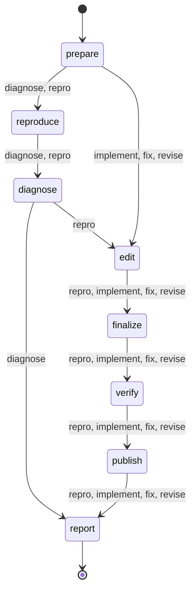

# emdashbot lifecycle machines

<!-- Generated from .flue/lib/machine.ts by `pnpm bot:generate`. Do not edit by hand. -->

The issue lifecycle coordinates the long-lived GitHub item. The agent run lifecycle records one bounded execution attempt. GitHub labels project the issue state; run mode and phase remain in Durable Object storage.

## Issue lifecycle

Entry state: `unmanaged`. Kinds: `bug`, `enhancement`, `task`.

### Phases

| Phase | Label |
| --- | --- |
| `intake` | Triage |
| `evidence` | Investigate |
| `verdict` | Establish |
| `candidate` | Build |
| `preview` | Preview |
| `confirmation` | Confirm |
| `review` | Review |
| `complete` | Done |

### States

| State | Phase | Label | Board column | Terminal | Transient | Offered commands |
| --- | --- | --- | --- | --- | --- | --- |
| `unmanaged` | `intake` | — | (none) | no | no | `investigate`, `repro`, `fix`, `implement`, `decline` |
| `triage` | `intake` | `bot:triage` | Triage | no | no | `investigate`, `repro`, `fix`, `implement`, `decline` |
| `working` | `evidence` | `bot:working` | Working | no | yes | `status` |
| `blocked` | `candidate` | `bot:blocked` | Blocked | no | no | `investigate`, `fix`, `implement`, `repro`, `retry`, `decline`, `take_over` |
| `awaiting_feedback` | `confirmation` | `bot:awaiting-feedback` | Awaiting feedback | no | no | `confirm`, `reject`, `retry`, `take_over` |
| `in_review` | `review` | `bot:in-review` | In review | no | no | `revise`, `decline`, `take_over` |
| `human_owned` | `review` | `bot:human-owned` | Human owned | no | no | `hand_back` |
| `done` | `complete` | `bot:done` | Done | yes | no | `reopen` |
| `declined` | `complete` | `bot:declined` | Declined | yes | no | `reopen` |
| `failed` | `candidate` | `bot:failed` | Failed | no | no | `resume`, `retry`, `implement`, `repro`, `investigate`, `decline` |
| `investigating` | `evidence` | `bot:investigating` | Investigating | no | yes | `status` |
| `reproduced` | `verdict` | `bot:reproduced` | Reproduced | no | no | `fix`, `implement`, `investigate`, `decline`, `take_over` |
| `diagnosed` | `verdict` | `bot:diagnosed` | Diagnosed | no | no | `fix`, `implement`, `investigate`, `decline`, `take_over` |
| `not_reproduced` | `verdict` | `bot:not-reproduced` | Not reproduced | no | no | `investigate`, `decline`, `take_over` |
| `needs_info` | `verdict` | `bot:needs-info` | Needs info | no | no | `investigate`, `decline`, `take_over` |
| `fixing` | `candidate` | `bot:fixing` | Fixing | no | yes | `status` |
| `preview_building` | `preview` | `bot:preview-building` | Building preview | no | yes | `status` |
| `awaiting_reporter` | `confirmation` | `bot:awaiting-reporter` | Awaiting reporter | no | no | `confirm`, `reject`, `decline`, `take_over` |

### Events

| Event | Category | Actors | Arg | Description |
| --- | --- | --- | --- | --- |
| `repro` | command | maintainer | — | Reproduce the issue as a bug and attempt a fix. |
| `investigate` | command | maintainer | `directive` | Reproduce and diagnose the issue as a bug, with evidence. Does not attempt a fix. |
| `implement` | command | maintainer | `directive` | Build the described change (feature or directed fix), skipping the bug-repro gate. |
| `fix` | command | maintainer | `directive` | Build a candidate bug fix and post a preview for the reporter to try. |
| `retry` | command | maintainer | — | Re-run the bug reproduction pipeline. |
| `resume` | command | maintainer | `directive` | Continue the saved conversation and workspace from a timed-out run. |
| `revise` | command | maintainer | `feedback` | Send review feedback back into the agent to update the open PR branch. |
| `confirm` | command | reporter, maintainer | — | Confirm the staged fix works; open a PR. |
| `reject` | command | reporter, maintainer | `feedback` | The staged fix does not work; retry with feedback. |
| `decline` | command | maintainer | — | Won't be actioned; move to declined. |
| `reopen` | command | maintainer | — | Bring a terminal item back into triage. |
| `take_over` | command | maintainer | — | A maintainer takes the item; the bot disengages but stays on the board. |
| `hand_back` | command | maintainer | — | Return a human-owned item to the bot. |
| `reset` | command | maintainer | — | Force-reset to triage. Maintainer recovery for conflicting state labels. |
| `status` | command | reporter, maintainer | — | Render the item's current state and available commands. |
| `help` | command | reporter, maintainer | — | Show the command grammar. |
| `agent.skipped` | agent result | system | — | Agent skipped (non-bug kind, or repro needs external/prod-only conditions). |
| `agent.not_reproduced` | agent result | system | — | Agent could not reproduce the issue. |
| `agent.by_design` | agent result | system | — | Agent verified the behaviour as intended. |
| `agent.reproduced` | agent result | system | — | Reproduced, but the fix needs a human decision. |
| `agent.diagnosed` | agent result | system | — | Root cause identified without a confirming reproduction. |
| `agent.fix_ready` | agent result | system | — | A candidate change is published on bot/fix-<n>. |
| `agent.needs_info` | agent result | system | — | Investigation is blocked on information only the reporter can supply. |
| `agent.failed` | agent result | system | — | Agent run errored or produced no usable result. |
| `pr.opened` | pr lifecycle | system | — | A bot PR was opened for this item. |
| `pr.merged` | pr lifecycle | system | — | The bot PR was merged. |
| `pr.closed` | pr lifecycle | system | — | The bot PR was closed without merging. |
| `pr.changes_requested` | pr lifecycle | system | — | A reviewer requested changes (review sub-state). |
| `pr.approved` | pr lifecycle | system | — | A reviewer approved the PR (review sub-state). |
| `preview.ready` | preview | system | — | The preview deploy for the candidate change is live; link ready to post. |
| `preview.failed` | preview | system | — | The preview deploy failed to build. |
| `expire` | timer | system | — | The reporter-confirmation window elapsed without a reply. |

### Transitions

| From | Event | To | Action |
| --- | --- | --- | --- |
| `unmanaged` | `repro` | `working` | `investigate.repro` |
| `unmanaged` | `fix` | `fixing` | `investigate.implement` |
| `unmanaged` | `implement` | `fixing` | `investigate.implement` |
| `unmanaged` | `decline` | `declined` | — |
| `triage` | `repro` | `working` | `investigate.repro` |
| `triage` | `fix` | `fixing` | `investigate.implement` |
| `triage` | `implement` | `fixing` | `investigate.implement` |
| `triage` | `decline` | `declined` | — |
| `working` | `agent.skipped` | `blocked` | — |
| `working` | `agent.not_reproduced` | `not_reproduced` | — |
| `working` | `agent.by_design` | `blocked` | — |
| `working` | `agent.reproduced` | `reproduced` | — |
| `working` | `agent.diagnosed` | `diagnosed` | — |
| `working` | `agent.needs_info` | `needs_info` | — |
| `working` | `agent.fix_ready` | `awaiting_feedback` | — |
| `working` | `agent.failed` | `failed` | — |
| `blocked` | `fix` | `fixing` | `investigate.implement` |
| `blocked` | `implement` | `fixing` | `investigate.implement` |
| `blocked` | `repro` | `working` | `investigate.repro` |
| `blocked` | `retry` | `working` | `investigate.repro` |
| `blocked` | `decline` | `declined` | — |
| `blocked` | `take_over` | `human_owned` | — |
| `awaiting_feedback` | `confirm` | `in_review` | `openPr` |
| `awaiting_feedback` | `reject` | `working` | `investigate.revise` |
| `awaiting_feedback` | `retry` | `working` | `investigate.repro` |
| `awaiting_feedback` | `take_over` | `human_owned` | — |
| `in_review` | `pr.opened` | `in_review` | — |
| `in_review` | `pr.approved` | `in_review` | — |
| `in_review` | `pr.changes_requested` | `in_review` | — |
| `in_review` | `revise` | `working` | `investigate.revise` |
| `in_review` | `pr.merged` | `done` | — |
| `working` | `pr.merged` | `done` | — |
| `awaiting_feedback` | `pr.merged` | `done` | — |
| `in_review` | `pr.closed` | `blocked` | — |
| `working` | `pr.closed` | `blocked` | — |
| `awaiting_feedback` | `pr.closed` | `blocked` | — |
| `unmanaged` | `reset` | `triage` | — |
| `triage` | `reset` | `triage` | — |
| `working` | `reset` | `triage` | — |
| `blocked` | `reset` | `triage` | — |
| `awaiting_feedback` | `reset` | `triage` | — |
| `in_review` | `reset` | `triage` | — |
| `human_owned` | `reset` | `triage` | — |
| `done` | `reset` | `triage` | — |
| `declined` | `reset` | `triage` | — |
| `failed` | `reset` | `triage` | — |
| `in_review` | `decline` | `declined` | `closePr` |
| `in_review` | `take_over` | `human_owned` | — |
| `human_owned` | `hand_back` | `triage` | — |
| `done` | `reopen` | `triage` | — |
| `declined` | `reopen` | `triage` | — |
| `failed` | `resume` | saved: `working`, `investigating`, or `fixing` | `investigate.resume` |
| `failed` | `retry` | `working` | `investigate.repro` |
| `failed` | `implement` | `fixing` | `investigate.implement` |
| `failed` | `repro` | `working` | `investigate.repro` |
| `failed` | `decline` | `declined` | — |
| `unmanaged` | `investigate` | `investigating` | `investigate.diagnose` |
| `triage` | `investigate` | `investigating` | `investigate.diagnose` |
| `blocked` | `investigate` | `investigating` | `investigate.diagnose` |
| `failed` | `investigate` | `investigating` | `investigate.diagnose` |
| `not_reproduced` | `investigate` | `investigating` | `investigate.diagnose` |
| `needs_info` | `investigate` | `investigating` | `investigate.diagnose` |
| `reproduced` | `investigate` | `investigating` | `investigate.diagnose` |
| `investigating` | `agent.reproduced` | `reproduced` | — |
| `investigating` | `agent.diagnosed` | `diagnosed` | — |
| `investigating` | `agent.not_reproduced` | `not_reproduced` | — |
| `investigating` | `agent.needs_info` | `needs_info` | — |
| `investigating` | `agent.by_design` | `blocked` | — |
| `investigating` | `agent.skipped` | `blocked` | — |
| `investigating` | `agent.failed` | `failed` | — |
| `reproduced` | `fix` | `fixing` | `investigate.fix` |
| `reproduced` | `implement` | `fixing` | `investigate.fix` |
| `reproduced` | `decline` | `declined` | — |
| `reproduced` | `take_over` | `human_owned` | — |
| `diagnosed` | `fix` | `fixing` | `investigate.fix` |
| `diagnosed` | `implement` | `fixing` | `investigate.fix` |
| `diagnosed` | `decline` | `declined` | — |
| `diagnosed` | `take_over` | `human_owned` | — |
| `diagnosed` | `investigate` | `investigating` | `investigate.diagnose` |
| `not_reproduced` | `decline` | `declined` | — |
| `not_reproduced` | `take_over` | `human_owned` | — |
| `needs_info` | `decline` | `declined` | — |
| `needs_info` | `take_over` | `human_owned` | — |
| `fixing` | `agent.fix_ready` | `preview_building` | — |
| `fixing` | `agent.failed` | `failed` | — |
| `fixing` | `agent.by_design` | `blocked` | — |
| `fixing` | `agent.skipped` | `blocked` | — |
| `preview_building` | `preview.ready` | `awaiting_reporter` | — |
| `preview_building` | `preview.failed` | default: `reproduced`; `enhancement`: `blocked`; `task`: `blocked` | — |
| `awaiting_reporter` | `confirm` | `in_review` | `openDraftPr` |
| `awaiting_reporter` | `reject` | default: `reproduced`; `enhancement`: `blocked`; `task`: `blocked` | `reapBranch` |
| `awaiting_reporter` | `expire` | default: `reproduced`; `enhancement`: `blocked`; `task`: `blocked` | `reapBranch` |
| `awaiting_reporter` | `take_over` | `human_owned` | — |
| `awaiting_reporter` | `decline` | `declined` | `reapBranch` |
| `investigating` | `reset` | `triage` | — |
| `reproduced` | `reset` | `triage` | — |
| `not_reproduced` | `reset` | `triage` | — |
| `needs_info` | `reset` | `triage` | — |
| `fixing` | `reset` | `triage` | — |
| `preview_building` | `reset` | `triage` | — |
| `awaiting_reporter` | `reset` | `triage` | — |

### Diagram

```mermaid
stateDiagram-v2
    [*] --> unmanaged
    unmanaged --> working: repro / investigate.repro
    unmanaged --> fixing: fix / investigate.implement
    unmanaged --> fixing: implement / investigate.implement
    unmanaged --> declined: decline
    triage --> working: repro / investigate.repro
    triage --> fixing: fix / investigate.implement
    triage --> fixing: implement / investigate.implement
    triage --> declined: decline
    working --> blocked: agent.skipped
    working --> not_reproduced: agent.not_reproduced
    working --> blocked: agent.by_design
    working --> reproduced: agent.reproduced
    working --> diagnosed: agent.diagnosed
    working --> needs_info: agent.needs_info
    working --> awaiting_feedback: agent.fix_ready
    working --> failed: agent.failed
    blocked --> fixing: fix / investigate.implement
    blocked --> fixing: implement / investigate.implement
    blocked --> working: repro / investigate.repro
    blocked --> working: retry / investigate.repro
    blocked --> declined: decline
    blocked --> human_owned: take_over
    awaiting_feedback --> in_review: confirm / openPr
    awaiting_feedback --> working: reject / investigate.revise
    awaiting_feedback --> working: retry / investigate.repro
    awaiting_feedback --> human_owned: take_over
    in_review --> in_review: pr.opened
    in_review --> in_review: pr.approved
    in_review --> in_review: pr.changes_requested
    in_review --> working: revise / investigate.revise
    in_review --> done: pr.merged
    working --> done: pr.merged
    awaiting_feedback --> done: pr.merged
    in_review --> blocked: pr.closed
    working --> blocked: pr.closed
    awaiting_feedback --> blocked: pr.closed
    unmanaged --> triage: reset
    triage --> triage: reset
    working --> triage: reset
    blocked --> triage: reset
    awaiting_feedback --> triage: reset
    in_review --> triage: reset
    human_owned --> triage: reset
    done --> triage: reset
    declined --> triage: reset
    failed --> triage: reset
    in_review --> declined: decline / closePr
    in_review --> human_owned: take_over
    human_owned --> triage: hand_back
    done --> triage: reopen
    declined --> triage: reopen
    failed --> working: resume [saved] / investigate.resume
    failed --> investigating: resume [saved] / investigate.resume
    failed --> fixing: resume [saved] / investigate.resume
    failed --> working: retry / investigate.repro
    failed --> fixing: implement / investigate.implement
    failed --> working: repro / investigate.repro
    failed --> declined: decline
    unmanaged --> investigating: investigate / investigate.diagnose
    triage --> investigating: investigate / investigate.diagnose
    blocked --> investigating: investigate / investigate.diagnose
    failed --> investigating: investigate / investigate.diagnose
    not_reproduced --> investigating: investigate / investigate.diagnose
    needs_info --> investigating: investigate / investigate.diagnose
    reproduced --> investigating: investigate / investigate.diagnose
    investigating --> reproduced: agent.reproduced
    investigating --> diagnosed: agent.diagnosed
    investigating --> not_reproduced: agent.not_reproduced
    investigating --> needs_info: agent.needs_info
    investigating --> blocked: agent.by_design
    investigating --> blocked: agent.skipped
    investigating --> failed: agent.failed
    reproduced --> fixing: fix / investigate.fix
    reproduced --> fixing: implement / investigate.fix
    reproduced --> declined: decline
    reproduced --> human_owned: take_over
    diagnosed --> fixing: fix / investigate.fix
    diagnosed --> fixing: implement / investigate.fix
    diagnosed --> declined: decline
    diagnosed --> human_owned: take_over
    diagnosed --> investigating: investigate / investigate.diagnose
    not_reproduced --> declined: decline
    not_reproduced --> human_owned: take_over
    needs_info --> declined: decline
    needs_info --> human_owned: take_over
    fixing --> preview_building: agent.fix_ready
    fixing --> failed: agent.failed
    fixing --> blocked: agent.by_design
    fixing --> blocked: agent.skipped
    preview_building --> awaiting_reporter: preview.ready
    preview_building --> reproduced: preview.failed [default]
    preview_building --> blocked: preview.failed [enhancement, task]
    awaiting_reporter --> in_review: confirm / openDraftPr
    awaiting_reporter --> reproduced: reject [default] / reapBranch
    awaiting_reporter --> blocked: reject [enhancement, task] / reapBranch
    awaiting_reporter --> reproduced: expire [default] / reapBranch
    awaiting_reporter --> blocked: expire [enhancement, task] / reapBranch
    awaiting_reporter --> human_owned: take_over
    awaiting_reporter --> declined: decline / reapBranch
    investigating --> triage: reset
    reproduced --> triage: reset
    not_reproduced --> triage: reset
    needs_info --> triage: reset
    fixing --> triage: reset
    preview_building --> triage: reset
    awaiting_reporter --> triage: reset
```

## Agent run lifecycle

A run stores its mode, selected phase plan, current phase, status, attempt, and fixed deadline independently from the issue state. An explicit `implement` directive selects the direct implementation plan and omits reproduction and diagnosis.

### Phases

| Phase | Label |
| --- | --- |
| `prepare` | Prepare |
| `reproduce` | Reproduce |
| `diagnose` | Diagnose |
| `edit` | Edit |
| `finalize` | Finalize |
| `verify` | Verify |
| `publish` | Publish |
| `report` | Report |

### Plans

| Mode | Ordered phases |
| --- | --- |
| `diagnose` | `prepare` → `reproduce` → `diagnose` → `report` |
| `repro` | `prepare` → `reproduce` → `diagnose` → `edit` → `finalize` → `verify` → `publish` → `report` |
| `implement` | `prepare` → `edit` → `finalize` → `verify` → `publish` → `report` |
| `fix` | `prepare` → `edit` → `finalize` → `verify` → `publish` → `report` |
| `revise` | `prepare` → `edit` → `finalize` → `verify` → `publish` → `report` |

### Task-specific work plan

Each agent run creates a bounded work plan for its specific directive through `update_work_plan`. The plan is independent from the run phase plan: it may describe arbitrary repository work, while the run phases track deadlines and publication.

The Orchestrator stores the plan and projects it into one evolving GitHub comment for that run and into the dashboard. Resume updates the same run comment. A fresh retry or directive creates a new run comment. The final agent result updates the same comment; `Completed` is used only when the mode's trusted outcome succeeds.

### Statuses

`running`, `succeeded`, `failed`, `timed_out`, `cancelled`

### Diagram

